## <ins>Phindr3D User Manual</ins>

### <ins>Main Program</ins>

 

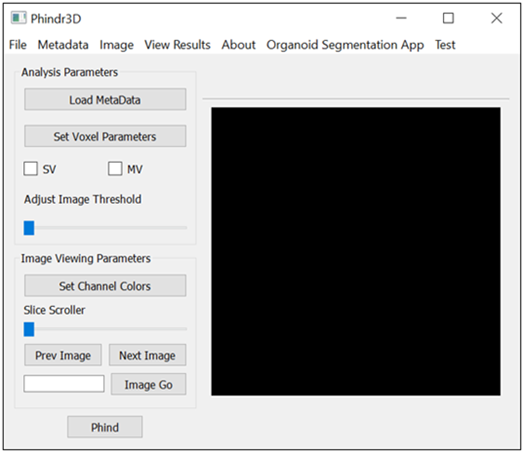</img>

 

### <ins>Creating Metadata</ins>

Phindr3D requires a metadata file to properly load 3D multichannel images.  

- Clicking on Metadata > Create Metadatafile opens a new window for creating metadata.
 

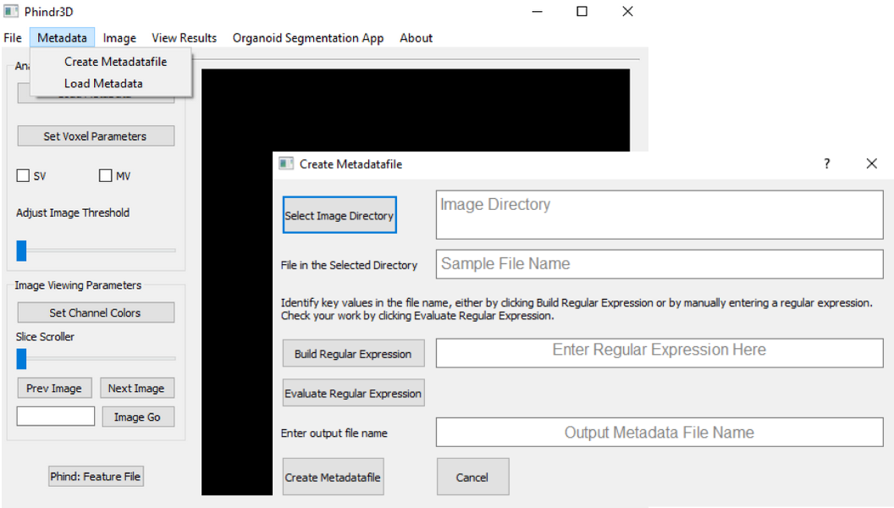</img>

 

- Use the Select Image Directory to select the desired image folder. This will also display a random image name from the folder in the Sample File Name box.

- A regular expression is required to parse the image file names. These can be typed by hand (see example below) or created using the OR Create regex button.

- The OR Create regex option opens a window for creating regular expressions without needing to type them by hand (see instructions below.)

- The regular expression can be tested with Evaluate Regular Expression and the metadata file is saved with the images by filling in Output Metadata File Name and clicking Create File.

### <ins>Regular Expression Example</ins>

Sample file name:

> r03c19f01p07-ch1sk1fk1fl1.tiff

Matching regular expression:

> (?<Well>\w+)f(?<Field>\d+)p(?<Stack>\d+)ch(?<Channel>\d)sk1fk1fl1.tiff

#### <ins>Create Regular Expression</ins>

 

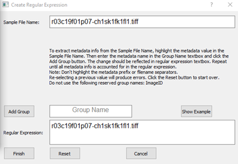</img>

 

- For each information group of interest in the file name, highlight the key value, and add a group label in the Group Name box. For numerical information such as channel or z planes, highlight only the numbers (e.g. ...ch1... >> ...ch<mark>1</mark>...).
 

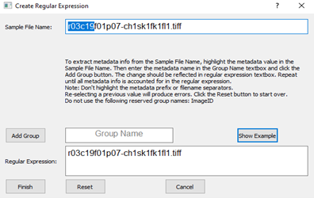</img>

 

- The Add Group button adds the changes to the regular expression.

 

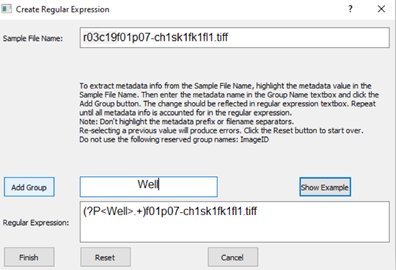</img>

 

- Once all relevant information from the image file name is captured in the regular expression, the Finish button sends the regular expression back to the metadata window.

 

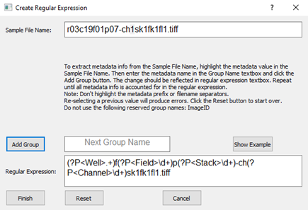</img>

 

- Note: Phindr3D is designed for multichannel 3D images. The regular expression MUST have a "Channel" group for the channel number and a "Stack" group for the z plane number.

### <ins>Organoid Contour Segmentation</ins>

- Ensure that the images for segmentation are in a dedicated folder, separate from other images (e.g. D:\ ... \experiment1\OrganoidsForSegmentation\).

- Create metadata file in the image folder (see metadata instructions for Phindr3D).

#### <ins>Running from the Phindr3D App</ins>

- Select the "Organoid Segmentation App" tab from the top menu bar.
 

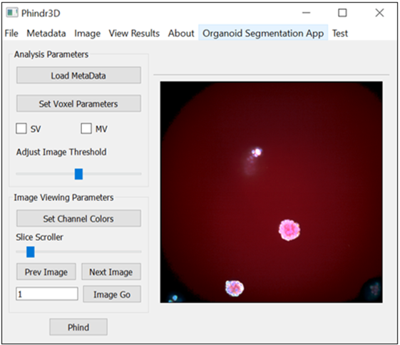</img>

 

- In the Organoid Segmentation Window, clicking the Segment button will prompt for an input metadata file and an output folder for the segmented images. These can also be input individually by clicking on Select Metadata File and Set output path. The Segment button will also start running segmentation.
 

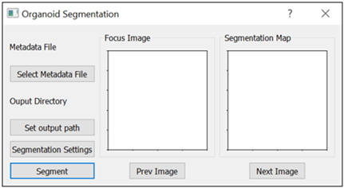</img>

 

- Running segmentation will create two folders in the output location. The "SegmentedImages" folder contains the segmented organoid images which can be run through Phindr3D (See Phindr3D instructions). The "LabelledImages" folder can be used to evaluate the segmentation results.

- The Segmentation Settings button opens a new window for changing and saving segmentation settings. (See the segmentation settings section below for details)

#### <ins>Segmentation Settings Details</ins>

The default segmentation settings are a good starting point for a wide range of images. However, better results may be achieved by changing the settings as needed (See descriptions below).
 

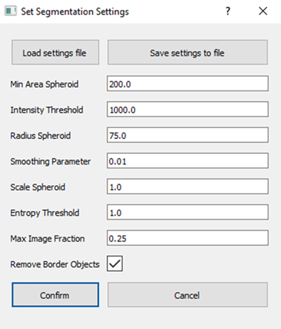</img>

 

Clicking Confirm will save the settings displayed for the current session, including any changes. It is also possible to save a specific settings configuration for later use by clicking Save settings to file. Previously saved segmentation settings files can be loaded by clicking Load settings file.

- Min Area Spheroid: objects with a cross sectional area of fewer pixels than the listed value are discarded.

- Intensity Threshold: objects with mean intensity lower than the listed value are discarded.

- Radius Spheroid: approximate object radius.

- Smoothing Parameter: smoothing parameter for image smoothing in frequency domain.

- Scale Spheroid: scaling factor for segmentation refinement.

- Entropy Threshold: objects with mean image entropy lower than the listed value are discarded. Noisy parts of an image have higher entropy than background areas with consistent intensity.

- Max Image Fraction: maximum fraction of the image taken up by an object. Can be used to allow/exclude large objects.

- Remove Border Objects: when checked, objects touching the edges of the image are discarded.

#### <ins>Set Channel Colors</ins>

Each channel will be assigned a pseudocolor that can be changed by the user by pressing Set Channel Colors. The resulting image is the mixed color intensities from the overlapping channels
 

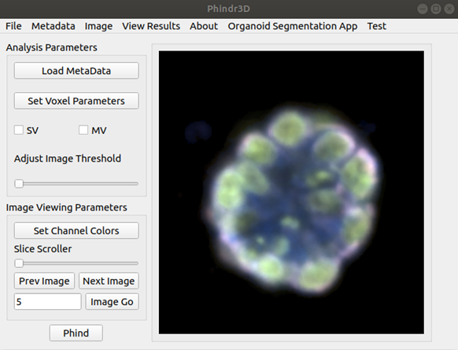</img>

 

The color of the Channel button is the current base pseudocolor.
 

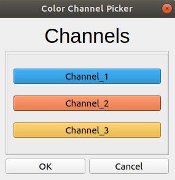</img>

 

#### <ins>Set Voxel Parameters</ins>

Super Voxel 
- groups neighbouring pixels together (patch/tile size).

Mega Voxel 
- groups neighbouring Super Voxels together

Categories 
- number of bins  

Normalise Intensity per Condition 
- Training set and Image Thresholding/Normalization based on condition labels

Background Voxels 
- Voxels with majority of pixels below image threshold

\#Training Images 
- Number of randomly selected images for training

Train by Condition 
- Training set grouped by condition labels 

 

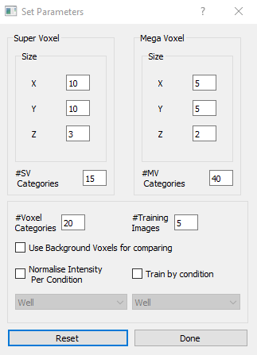</img>

 

#### <ins>Export/Import Session</ins>
To export the current session, go to the menu tab 
 
File >> Export >> Session
(session data saved as a .pickle file)
 

To import the previously saved session data (.pickle file), go to the menu tab 
 
File >> Import >> Entire Session. Then select the .pickle file.
 

To import only the previously saved session parameters (.pickle file), go to the menu tab 
 
File >> Import >> Parameters from Session. Then select the .pickle file. 
 
 
Note: The 'Parameters from Session' option may only be used if the metadata file is already loaded. If used on a different dataset, may give errors.
 
#### <ins>Results Window</ins>

Visualize Phindr analysis clusters and view/export classification and clustering results 

 

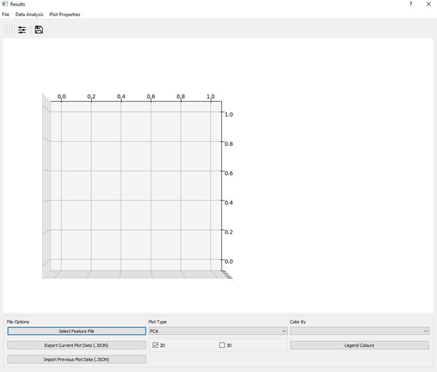</img>

 

- To import the Feature File generated by Phindr analysis, click either Select Feature File button or menu action   File >> Input Feature File from the main menu (Red box).

- Once the feature file is selected, the software will ask the user to define Groupings (i.e.
all columns except the features \[MV1, MV2, etc\]) from the feature file. Press Select All to filter by all Groupings (Recommended). Filter By Feature(s) will have a choice of MV (or if available Texture_Features). Channels Column displays detected Channels.

 

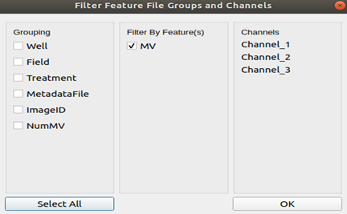</img>

 

- Phindr3D performs a PCA analysis by default and loads the plot on the plot window. The user can change the type of plot using the drop down menu as well as choose between 2D/3D plots (Yellow box)

- By using the ‘Color by’ dropbox, the data points will be grouped and coloured according to its label value (label options are from the Groupings previously selected from “Filter Feature File Groups and Channels” window) (Blue box)

- Legend Colours: Select custom colours for class labels/data points 

- The plots can be exported as vector graphics (click save button (Magenta Box) specify file name and extension when saving. Ex: “figure1.svg” -> figure1 as svg file format)

- Export Current Plot Data : Saves current plot coordinates and plot type as .JSON file. 

- Import Previous Plot Data: Imports .JSON file generated from “Export Current Plot Data” and corresponding Feature File (check that the Feature File path in the .JSON file is correct) 

### <ins>Show Image</ins>

To see the corresponding image for any point on the plot, hover over the point, and right-click

 

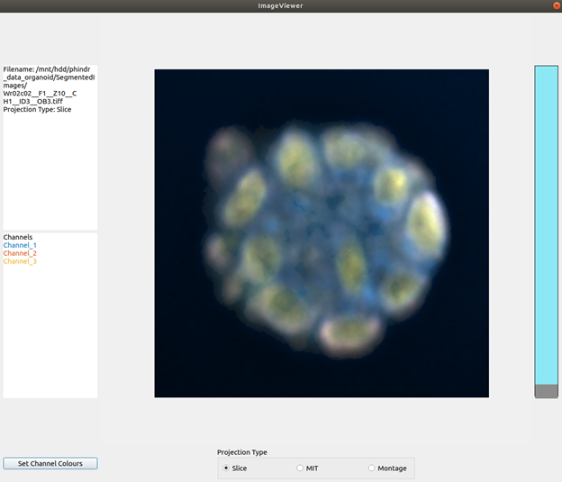</img>

 

### <ins>Classify Image Data</ins>

- Click Data Analysis >> Classification >> Select Classes

- Select the classes and click OK. Once the classifier is built, the output is saved at a user-defined location. 

- Note: Must select at least two classes. Selected classes must have more than 1 data point. Class options are based on ‘Color by’ Dropbox (Classes displayed in the legend)

 

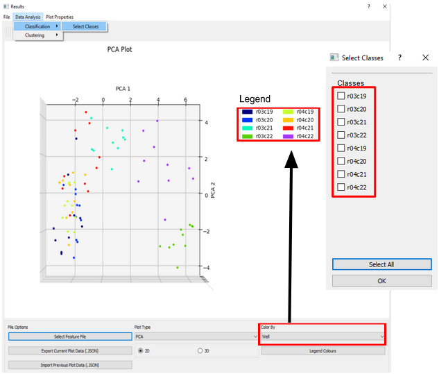</img>

 

### <ins>Cluster Image Data</ins>

 

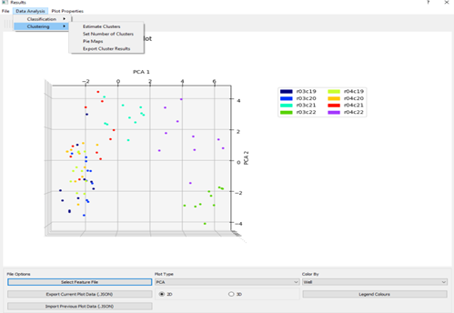</img>

 

- Automated Cluster Estimation: Click Data Analysis >> Clustering >> Estimate Clusters

 

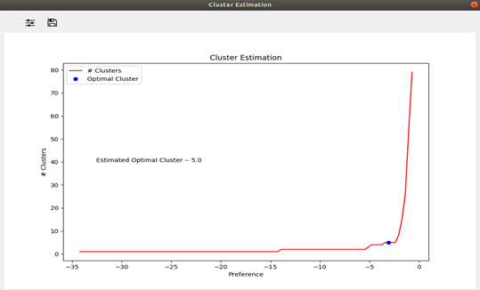</img>

 

- Set Clusters: Click Data Analysis >> Clustering >> Set Number of Clusters (Recommended to run Automated Cluster Estimation first to get recommended number of clusters -> “Estimated Optimum Cluster” from Cluster Estimation graph)

- Enter number of clusters then Press OK to confirm. Click Close when finished.
 

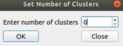</img>
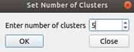</img>

 

- Pie Charts: Click Data Analysis >> Clustering >> Pie Maps (Only available after clustering)

- Note: Colours are based on "Color by" dropbox and Legend Colours

 

</img>

 

- Export: Click Data Analysis >> Clustering >> Export Clustering Results (Only available
after clustering)

### <ins>Plot Rotation</ins>

There are options available to enable/disable rotation of the scatter plot. If enabled, use the left-click and drag to rotate the plot (If 3D Plot Type then rotation is automatically enabled).
Reset plot view will return rotation to default xy-plane view as seen below. 

 

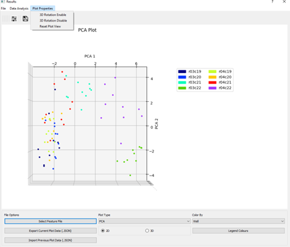</img>

 

