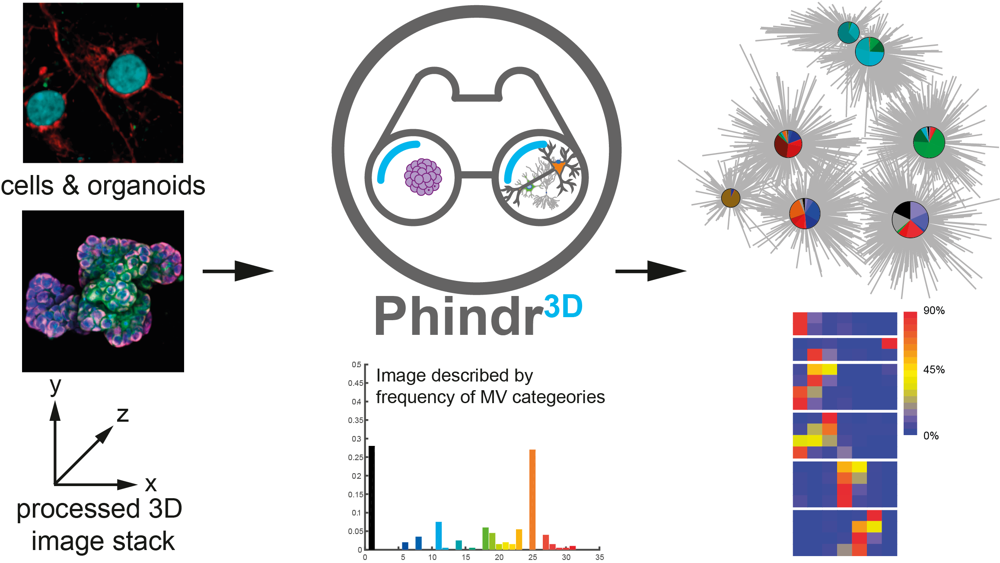

</img>

## <ins>Phindr3D</ins>

:microscope: Phindr3D is a comprehensive shallow-learning framework for automated quantitative phenotyping of three-dimensional (3D) high content screening image data using unsupervised data-driven voxel-based feature learning, which enables computationally facile classification, clustering and data visualization. 
 

</img>

 

### <ins>Citation</ins>
<i>Please cite the original manuscript if you find Phindr3D useful for your work:</i>
 
Mergenthaler P, Hariharan S, Pemberton JM, Lourenco C, Penn LZ, Andrews DW (2021) Rapid 3D phenotypic analysis of neurons and organoids using data-driven cell segmentation-free machine learning. PLoS Comput Biol 17(2): e1008630. https://doi.org/10.1371/journal.pcbi.1008630. 

### <ins>Installation</ins>

* To install the stand-alone program, download the executable *Phindr3D.exe* from the Releases panel in the Github repository. This executable includes *Phindr3D* and the Organoid Contour Segmentation app. 
* The executable is built using the code written in Python, in a Python 3.10 environment. To run the Phindr3D Python code directly, download the repository, configure the Python environment to include the dependencies specified in the [**libraries**](Phindr3D-Python/docs/libraries) file, and run the Python code [**here**](Phindr3D-Python).

### <ins>3D Data Sets</ins>

The full 3D microscopy data sets generated in this study were deposited to the Open Microscopy Image Data Resource repository (http://idr.openmicroscopy.org) under accession number idr0105 *(in progress)*.

Test image data sets with an excerpt of the neuron and organoid data that will allow quick evaluation of the core features of Phindr3D were deposited to the open science platform Zenodo (https://zenodo.org; neuron data: DOI <a href="https://dx.doi.org/10.5281/zenodo.4064148" target="_blank" rel="noopener noreferrer">10.5281/zenodo.4064148</a>; MCF10A organoid data: DOI <a href=https://dx.doi.org/10.5281/zenodo.4384912>10.5281/zenodo.4384912</a>). Numerical data for the figure panels were deposited to Zenodo (https://zenodo.org; DOI: <a href=https://dx.doi.org/10.5281/zenodo.4385040> 10.5281/zenodo.4385040</a>). 

### <ins>User Manual</ins>
A basic user manual is available [**here**](Manuals/Phindr3D_Python_UserManual.md). Visit our [**FAQ**](https://github.com/santoshhariharan/Phindr3D/wiki/FAQ) page for answers to common questions. Note that many answers may pertain to the earlier MATLAB implementation of Phindr3D.

### <ins>Phindr3D Organoid Contour Segmentation App</ins>
The organoid contour segmentation feature of Phindr3D (the Python implementation) is provided within the *Phindr3D* application. Please see the *Phindr3D* manual [**here**](Manuals/Phindr3D_Python_UserManual.md) and [**Figure 5D**](https://journals.plos.org/ploscompbiol/article/figure?id=10.1371/journal.pcbi.1008630.g005) or the [**Materials & Methods Section**](https://journals.plos.org/ploscompbiol/article?id=10.1371/journal.pcbi.1008630#sec009) of the *PLOS Computational Biology Paper* for details.

