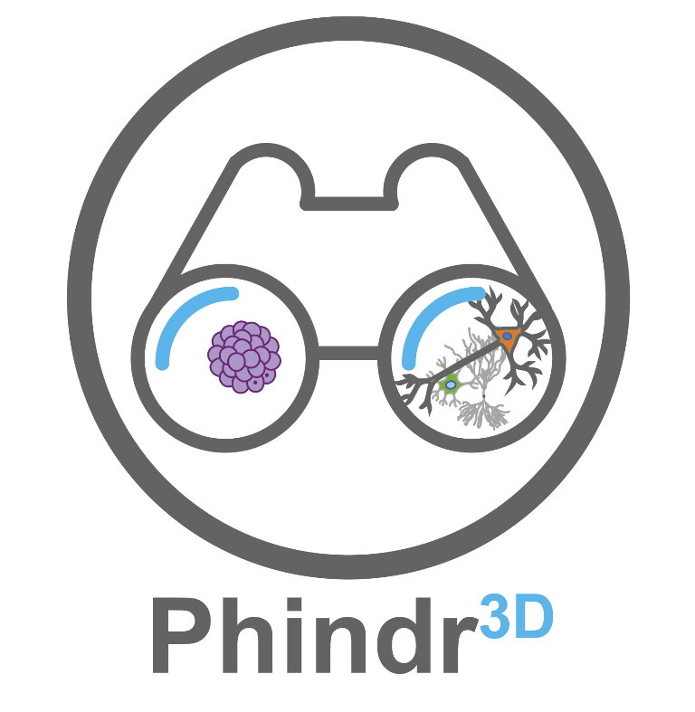

</img>

## <ins>Phindr3D</ins>

:microscope: Phindr3D is a comprehensive shallow-learning framework for automated quantitative phenotyping of three-dimensional (3D) high content screening image data using unsupervised data-driven voxel-based feature learning, which enables computationally facile classification, clustering and data visualization. 

### <ins>Citation</ins>
<i>Please cite the original manuscript if you find Phindr3D useful for your work:</i>
 
Mergenthaler P, Hariharan S, Pemberton JM, Lourenco C, Penn LZ, Andrews DW (2021) Rapid 3D phenotypic analysis of neurons and organoids using data-driven cell segmentation-free machine learning. PLoS Comput Biol 17(2): e1008630. https://doi.org/10.1371/journal.pcbi.1008630. 

### <ins>Installation</ins>

* To install the stand-alone program, download the executables [**here**](Executables) for the installation of a stand-alone program of *Phindr3D* or the *Phindr3D Organoid Contour Segmentation app*. If required, the Matlab runtime will be installed automatically. 
* The code is written using Matlab 64 bit version 2017b. To run Phindr3D directly from Matlab, download the repository and add it to your Matlab path.

#### Dependencies

Download the Matlab <b><i>drtoolbox</b></i> from [**here**](https://lvdmaaten.github.io/drtoolbox/) and add it to your Matlab path. For affinity propagation, the Matlab code is already available as part of the Phindr3D package (under "Third Party"; based on: *Brendan J. Frey; Delbert Dueck (2007). "Clustering by passing messages between data points". Science. 315 (5814): 972–976.*).

### <ins>3D Data Sets</ins>

The full 3D microscopy data sets generated in this study were deposited to the Open Microscopy Image Data Resource repository (http://idr.openmicroscopy.org) under accession number idr0105 *(in progress)*.

Test image data sets with an excerpt of the neuron and organoid data that will allow quick evaluation of the core features of Phindr3D were deposited to the open science platform Zenodo (https://zenodo.org; neuron data: DOI <a href="https://dx.doi.org/10.5281/zenodo.4064148" target="_blank" rel="noopener noreferrer">10.5281/zenodo.4064148</a>; MCF10A organoid data: DOI <a href=https://dx.doi.org/10.5281/zenodo.4384912>10.5281/zenodo.4384912</a>). Numerical data for the figure panels were deposited to Zenodo (https://zenodo.org; DOI: <a href=https://dx.doi.org/10.5281/zenodo.4385040> 10.5281/zenodo.4385040</a>). 

### <ins>User Manual</ins>
A basic user manual is available [**here**](Manuals/Phindr3D_UserManual.pdf). Visit our [**FAQ**](https://github.com/santoshhariharan/Phindr3D/wiki/FAQ) page for answers to common questions.

### <ins>Phindr3D Organoid Contour Segmentation App</ins>
The organoid contour segmentation feature of Phindr3D is provided as a separate app ("*Phindr3D-OrganoidCSApp*"). You can either download the Matlab code or a stand-alone executable program for Windows. Please see the [**Phindr3D Organoid Contour Segmentation App Manual**](Manuals/Phindr3D-Organoid-Contour-Segmentation-App_Manual.pdf) and [**Figure 5D**](https://journals.plos.org/ploscompbiol/article/figure?id=10.1371/journal.pcbi.1008630.g005) or the [**Materials & Methods Section**](https://journals.plos.org/ploscompbiol/article?id=10.1371/journal.pcbi.1008630#sec009) of the *PLOS Computational Biology Paper* for details.

#### Dependencies
There are no dependencies for the Phindr3D Organoid Contour Segmentation App.
